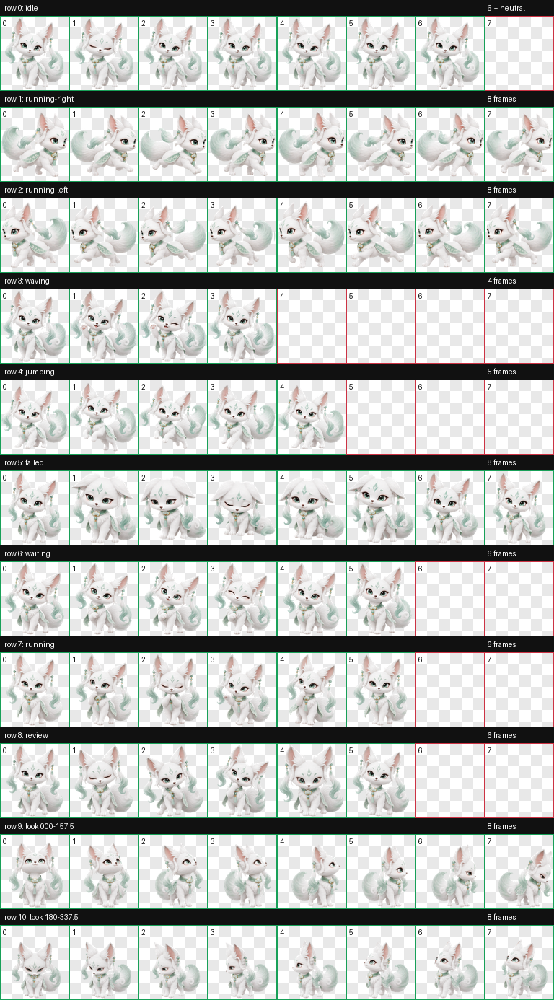

# 菲云 · Feiyun

菲云是一只清冷仙逸、温柔灵动的东方灵狐宠物。它身着如云般轻盈的白衣，点缀淡青玉色饰件与流动长尾：安静时优雅灵秀，工作时专注认真，等待时耐心陪伴，失败时也会努力振作。

Feiyun is an ethereal Eastern spirit fox companion with a calm, elegant presence and soft jade accents. Its animation set is designed for expressive desktop companionship: resting, working, waiting, reviewing, greeting, jumping, and reacting to setbacks.

## Preview



## Contents

- `pet.json` — Codex pet manifest
- `spritesheet.webp` — v2 animated sprite atlas
- `contact-sheet.png` — visual preview of all animation rows

## Sprite specification

- Format: WebP with RGBA transparency
- Version: Codex sprite v2
- Atlas: 8 columns × 11 rows
- Cell size: 192 × 208 px
- Atlas size: 1536 × 2288 px
- Standard animation rows: 9
- Look directions: 16, clockwise from `000` (up)

## Animation rows

| Row | State | Frames | Meaning |
| --- | --- | ---: | --- |
| 0 | `idle` | 6 | Calm breathing and blinking |
| 1 | `running-right` | 8 | Directional movement to screen-right |
| 2 | `running-left` | 8 | Directional movement to screen-left |
| 3 | `waving` | 4 | Friendly greeting |
| 4 | `jumping` | 5 | Playful vertical jump |
| 5 | `failed` | 8 | Blocked or failed reaction |
| 6 | `waiting` | 6 | Waiting for approval or input |
| 7 | `running` | 6 | Focused task processing |
| 8 | `review` | 6 | Inspecting completed work |
| 9 | Look directions `000`–`157.5` | 8 | Up through down-right |
| 10 | Look directions `180`–`337.5` | 8 | Down through up-left |

## Installation

Copy `pet.json` and `spritesheet.webp` into your Codex custom pet directory:

```text
%USERPROFILE%\.codex\pets\feiyun\
```

Restart or refresh Codex if the pet does not appear immediately.

## Design notes

菲云以柔和的白色、淡青玉色和粉色耳内色构成稳定识别度；视线动作由眼睛、眼睑、耳簇和头部的细微转向共同表达，脚掌与下半身保持稳定锚点。形象借鉴东方幻想美学的气质，但不复制任何真人肖像、Logo 或可识别文字。

## License

Unless otherwise stated by the publisher, this pet is shared for personal use and experimentation. Please preserve attribution to the original creator when redistributing it.
